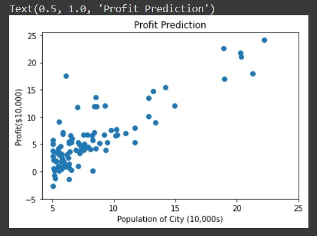
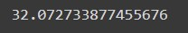
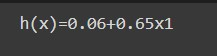
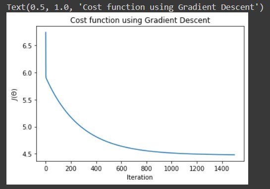
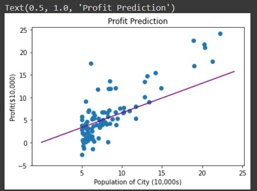
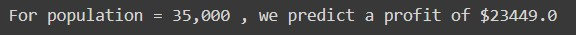
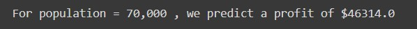

# Implementation-of-Linear-Regression-Using-Gradient-Descent

## Aim:
To write a program to predict the profit of a city using the linear regression model with gradient descent.

## Equipments Required:
1. Hardware – PCs
2. Anaconda – Python 3.7 Installation / Jupyter notebook

## Algorithm
### Step1:
Import the needed packages.
### Step2:
Read the txt file using read_csv.
### Step3:
Use numpy to find theta,x,y values.
### Step4:
To visualize the data use plt.plot.

## Program:
```
/*
Program to implement the linear regression using gradient descent.
Developed by: YUVARAJ.V
RegisterNumber: 212220220056
*/
```
```
import numpy as np
import pandas as pd
import matplotlib.pyplot as plt

df=pd.read_csv("ex1.txt",header=None)

plt.scatter(df[0],df[1])
plt.xticks(np.arange(5,30,step=5))
plt.yticks(np.arange(-5,30,step=5))
plt.xlabel("Population of City (10,000s)")
plt.ylabel("Profit($10,000)")
plt.title("Profit Prediction")

def computeCost(X,y,theta):
    m=len(y) #length of the training data
    h=X.dot(theta) #hypothesis
    square_err=(h-y)**2
    
    return 1/(2*m)*np.sum(square_err) #returning J

df_n=df.values
m=df_n[:,0].size
X=np.append(np.ones((m,1)),df_n[:,0].reshape(m,1),axis=1)
y=df_n[:,1].reshape(m,1)
theta=np.zeros((2,1))

computeCost(X,y,theta)

def gradientDescent(X,y,theta,alpha,num_iters):
    m=len(y)
    J_history=[]

def gradientDescent(X,y,theta,alpha,num_iters):
    m=len(y)
    J_history=[]
    for i in range(num_iters):
        predictions = X.dot(theta)
        error = np.dot(X.transpose(),(predictions -y))
        descent = alpha*(1/m )*error
        theta-=descent
        J_history.append(computeCost(X,y,theta))
        return theta,J_history

theta,J_history = gradientDescent(X,y,theta,0.01,1500)
print("h(x)="+str(round(theta[0,0],2))+"+"+str(round(theta[1,0],2))+"x1")

#Testing the implementation
theta,J_history = gradientDescent(X,y,theta,0.01,1500)
print("h(x)="+str(round(theta[0,0],2))+"+"+str(round(theta[1,0],2))+"x1")

plt.plot(J_history)
plt.xlabel("Iteration")
plt.ylabel("$J(\Theta)$")
plt.title("Cost function using Gradient Descent")

plt.scatter(df[0],df[1])
x_value=[x for x in range(25)]
y_value=[y*theta[1]+theta[0]for y in x_value]
plt.plot(x_value,y_value,color="purple")
plt.xticks(np.arange(5,30,step=5))
plt.yticks(np.arange(-5,30,step=5))
plt.xlabel("Population of City (10,000s)")
plt.ylabel("Profit($10,000)")
plt.title("Profit Prediction")

def predict(x,theta):
    predictions = np.dot(theta.transpose(),x)
    return predictions[0]

predict1=predict(np.array([1,3.5]),theta)*10000
print("For population = 35,000 , we predict a profit of $"+str(round(predict1,0)))

predict2=predict(np.array([1,7]),theta)*10000
print("For population = 70,000 , we predict a profit of $"+str(round(predict2,0)))

```

## Output:
## Profit Prediction:

## Computecost:



## Cost Function using Gradient Descent:

## Profit Prediction:

## 

## 



## Result:
Thus the program to implement the linear regression using gradient descent is written and verified using python programming.
